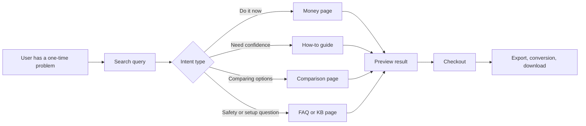
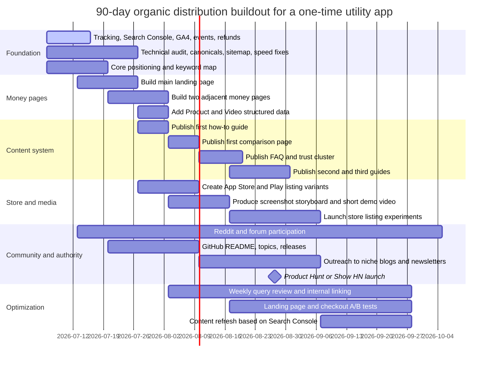

# Organic Distribution for One-Time Utility Apps

## Executive summary

One-time utility apps do not win by maximizing retention. They win by intercepting a user at the exact moment of a specific problem, matching that problem with a page or listing built for the query, showing the result fast, and asking for payment only after the user believes the job will be completed. For this model, the main growth system is not “brand marketing.” It is intent capture. Google Search Console is the best primary source for this because it shows the exact queries, clicks, impressions, CTR, and average position that already bring users to your site, while URL Inspection and sitemap tools show whether your core pages are actually crawlable and indexable. citeturn17view0turn24view0turn26view1turn17view17turn17view15

For most one-time utilities, the highest-quality channel is organic search, followed by app store search for mobile-native use cases. YouTube, Reddit, GitHub, Product Hunt, and Hacker News are usually supporting channels, not substitutes for search. Their best role is to create proof, links, trust, launch spikes, and reusable content assets that improve search and conversion over time. Founder case studies point in the same direction: one company grew in two stages, first through Reddit and then SEO; another got its first strong validation from Product Hunt with a clear description and screenshots; another switched from paid ads to SEO plus community and reported 500 plus signups in 45 days without ad spend. citeturn20view9turn20view10turn20view11

Keyword research for this model should begin with verbs that imply a job to be done: export, convert, transfer, back up, migrate, restore, recover, merge, zip, archive, import, remove, or compress. Those verbs should then be combined with the source system, target format, file type, operating system, and trust qualifiers such as offline, private, secure, or no upload. Google Ads Keyword Planner can generate ideas and forecasts, with historical metrics that refresh monthly, while Semrush and Ahrefs are useful for volume, intent, CPC, difficulty, clustering, and related-query discovery. Search Console should then become the source of truth once traffic begins, because it reflects your site’s real query footprint instead of market averages. citeturn19view6turn19view7turn17view19turn18view0turn18view1turn26view1

On-page execution matters because Google creates title links automatically from page content and external references, and may or may not use your meta description as the snippet. On app stores, discoverability is driven by metadata, categories, ratings, localized assets, and store-page experiments. Apple says keywords help determine where an app appears in search results and that ratings and reviews influence how the app ranks in search. Google Play says the app name is limited to 30 characters, the short description to 80, and the full description to 4,000, while repetitive or irrelevant keyword use can lead to policy problems. citeturn17view1turn17view2turn20view1turn20view0turn23view0turn23view1turn23view2

Technical SEO is not optional. Canonicals, hreflang, sitemaps, noindex rules, crawl access, Core Web Vitals, and fast page rendering all affect discoverability and evaluation. Google explicitly recommends structured data in JSON-LD where applicable, and product or video markup can improve how merchant pages or demo videos are understood and surfaced. At the same time, FAQ and HowTo rich result expectations should be reset: Google deprecated HowTo rich results and has greatly reduced the visibility of FAQ result types for most sites, so utility app teams should treat FAQ content as conversion and support content first, not as a rich-result trick. citeturn19view0turn19view1turn17view15turn17view16turn17view10turn17view11turn17view12turn17view13turn17view14turn19view3

The practical implication is simple. In the first 90 days, the highest-return work is to build one clean money page for each high-intent problem, one help page for each major adjacent question, one comparison page for each serious alternative, one short demo video for each core workflow, and one instrumented funnel that measures query to preview to checkout to purchase. Everything else should support those assets. citeturn26view1turn19view5turn30search0turn30search2

## Demand capture and query mapping

High-intent demand for one-time utilities is usually obvious in the wording. A query becomes commercially strong when it contains a job verb, a source, a target state, and sometimes a time or trust qualifier. “Export Chrome bookmarks to zip,” “move Spotify playlist to Apple Music,” and “backup browser profile offline” all signal immediate task completion. In contrast, broad phrases like “bookmark manager” or “music app” are often too ambiguous for a small utility product. Search Console’s Performance report is designed for exactly this analysis because it shows which queries are most likely to show your site and which ones actually produce clicks. citeturn17view0turn26view1

A good mapping system separates queries into a few page intents instead of sending every keyword to one home page. Transactional “do it now” queries should go to a money page. Informational “how do I…” queries should go to a guide with a visible product path. Comparison queries should go to an alternative page. Trust and troubleshooting queries should go to FAQ or support pages. This is partly an SEO decision and partly a conversion decision, because Google’s title and snippet systems try to represent the most relevant page for the phrasing used in the query. citeturn17view1turn17view2turn13search11



Keyword research should be run in layers, not in one tool. Start with real problem phrases from support requests, store reviews, forum questions, and your own product logs. Expand them with Keyword Planner for discover-new-keywords and search-volume forecasts. Then pass the list through Semrush for intent, volume, CPC, trend, and competition signals, and through Ahrefs for clustering and related-query expansion. After launch, use Search Console to prune terms that rank but do not convert, and to expand terms that already produce high CTR or sales. This sequence matters because Keyword Planner is built for advertisers, Semrush and Ahrefs are built for exploration, and Search Console measures actual traffic on your property. citeturn19view6turn19view7turn17view19turn18view0turn18view1turn26view1

A practical scoring model for a one-time utility keyword should overweight intent and underweight volume. A simple version is: commercial verb present, source and target named, current SERP shows utility pages rather than editorial media, and the page can preview an outcome before purchase. High CPC can help as a signal of monetary value, but low-volume exact-problem terms often outperform large broad terms in this model because the user is closer to completion than to research. This is an inference from how Keyword Planner, Semrush, and Search Console expose value signals, and from founder reports that search and community outperformed ad spend for these products. citeturn19view6turn17view19turn26view1turn20view11

For App Store and Google Play, the same intent logic applies, but metadata fields are tighter and search behavior is shorter. Apple says keywords help determine where an app displays in search results, and advises choosing keywords based on the words the audience will use and balancing less-common terms against harder, more popular terms. Google Play makes the main store listing fields explicit, with a 30-character app name, 80-character short description, and 4,000-character full description, plus localized assets and translations by market. citeturn20view1turn23view0turn23view1

### Sample keyword list for a hypothetical app

Below is an illustrative keyword map for a hypothetical product, **Export Chrome bookmarks to ZIP**. The list is intentionally biased toward task phrases rather than broad terms.

| Query | Intent | Priority | Recommended page |
|---|---|---:|---|
| export chrome bookmarks to zip | Transactional | High | Money page |
| chrome bookmarks export zip | Transactional | High | Money page |
| backup chrome bookmarks zip | Transactional | High | Money page |
| save chrome bookmarks as zip | Transactional | High | Money page |
| export browser bookmarks to zip | Transactional | High | Money page |
| chrome bookmark backup tool | Commercial | High | Money page |
| export chrome data to zip | Transactional | High | Money page |
| download chrome bookmarks backup | Transactional | High | Money page |
| export chrome favorites windows | Transactional | Medium | Money page |
| export chrome bookmarks mac | Transactional | Medium | Money page |
| chrome bookmarks html vs zip | Comparison | Medium | Comparison page |
| how to backup chrome bookmarks | Informational | High | Guide |
| where are chrome bookmarks stored | Informational | Medium | Guide |
| export chrome profile data | Informational | Medium | Guide |
| backup browser history and bookmarks | Commercial | Medium | Guide |
| export chrome bookmarks offline | Trust | High | FAQ or money page |
| is chrome bookmark export private | Trust | High | FAQ |
| chrome bookmark export no upload | Trust | High | FAQ or money page |
| alternative to chrome html export | Comparison | Medium | Comparison page |
| create archive of chrome bookmarks | Transactional | Medium | Money page |

### Channel comparison

The table below gives **directional planning ranges**, not platform benchmarks. The ranges are inferred from official platform mechanics and founder case studies for small utility products. In practice, SEO and app store search tend to convert best because intent is explicit, while Reddit, GitHub, YouTube, Product Hunt, and Hacker News work better as proof and amplification channels. citeturn17view0turn20view9turn20view10turn20view11turn29search6turn29search1turn29search2turn19view8turn19view9

| Channel | Traffic quality | Cost profile | Typical planning conversion | Best use |
|---|---|---|---|---|
| SEO | Very high | High setup, low marginal cost | 1% to 8% visitor to paid order | Exact-problem capture |
| App Store / Google Play search | High | Medium setup, review and localization overhead | 0.5% to 3% listing visitor to monetized install or paid unlock | Mobile-native utilities |
| YouTube | Medium to high | Moderate production cost | 0.3% to 2% viewer to paid visit or install | Demo, trust, proof |
| Reddit | Medium to high when native | Low cash cost, high community time | 0.2% to 2% click to paid order | Problem discovery, feedback, trust |
| GitHub | High for technical tools | Low cash cost, high docs time | 0.5% to 4% visitor to trial or paid order | CLI, open-core, migration tools |
| Product Hunt | Medium | Low cash cost, launch prep heavy | 0.2% to 2% visitor to paid order | Launch spike, social proof |
| Hacker News | Medium | Low cash cost, credibility-sensitive | 0.2% to 1.5% visitor to paid order | Technical launches, developer credibility |

## Landing pages, listings, and content that converts

The core rule for landing pages is message match. If the query is “export Chrome bookmarks to zip,” the title, H1, hero text, demo, and CTA should all say exactly that job in simple language. Google says title links are generated automatically from page content and references across the web, so the page’s visible primary heading and the HTML title should be aligned. Google also says the meta description is like a pitch, but it may use page content instead if that better matches the query. In other words, the safest approach is to write the page so both the visible copy and metadata tell the same story. citeturn17view1turn17view2

For a one-time utility, the landing page should usually present six facts above the fold: what the app does, what inputs it accepts, what output the user gets, how long it takes, whether the process is private or local, and what the one-time price includes. The conversion logic is outcome-first, not feature-first. This is an inference from the intent structure above and from founder stories where clear descriptions, screenshots, and feedback loops shaped early traction. citeturn20view10turn18view13

### Example landing page copy template

```text
Title tag:
Export Chrome Bookmarks to ZIP | Offline Utility for Windows and Mac

H1:
Export Chrome bookmarks to a ZIP file in under 2 minutes

Subhead:
Back up bookmarks, folders, and browser data into a clean ZIP archive.
Runs locally. No sync required. One-time payment.

Primary CTA:
Preview my archive

Trust line:
Your data stays on your device. No account required.

Supporting proof:
See exactly what will be included before you pay:
- bookmark count
- folder structure
- archive size
- last modified dates

Pricing block:
Pay once, export forever
$39 lifetime license
Includes Windows + Mac, free fixes for current Chrome versions
```

The best content strategy for this model is a small, dense set of utility content, not a giant generic blog. A high-performing site usually has one commercial page per task, one guide per adjacent “how to” question, one comparison page per serious alternative, one FAQ cluster for trust and edge cases, and one short video per core workflow. Guides should exist to rank and to reduce friction, but they should contain a visible path to the tool. Google’s people-first guidance supports this approach, and its later policy updates warn against spammy third-party content environments built only to exploit rankings. citeturn13search11turn28view1turn28view0

A practical content mix looks like this:

| Content type | Topic example | Goal |
|---|---|---|
| Money page | Export Chrome bookmarks to ZIP | Direct conversion |
| How-to guide | How to back up Chrome bookmarks on Windows and Mac | Capture informational demand |
| Comparison page | Chrome HTML export vs ZIP archive | Convert comparison traffic |
| Troubleshooting page | Why Chrome export only gives HTML | Catch frustration queries |
| FAQ / KB | Is my data uploaded, what files are included, refund policy | Reduce objections |
| Video demo | 60-second export walkthrough | Improve trust and click-through |

Structured data should be used selectively. Google recommends JSON-LD, and for utility products the most useful schema types are usually `Product` plus `Offer` on a paid landing page, and `VideoObject` on demo pages. Product and merchant listing markup can expose data such as price and availability in richer search experiences, and video markup can help Google understand demo content on watch pages. By contrast, teams should not spend time chasing FAQ or HowTo rich-result decoration for acquisition. Google deprecated HowTo rich results and has simplified those experiences heavily. citeturn5search3turn17view14turn17view13turn19view3

For app stores, the listing should be treated as a second landing page. Apple’s app name is limited to 30 characters and the subtitle to 30 characters. Apple also says keywords help determine where the app appears in search results, that discoverability depends on category choice, and that ratings and reviews influence ranking in search. On Google Play, the app name is 30 characters, the short description is 80, and the full description 4,000. Google explicitly warns against repetitive or misleading keyword use in titles and descriptions. citeturn23view0turn20view1turn20view0turn23view1turn23view2

For screenshot and preview flow, both stores reward clarity. Apple offers Product Page Optimization for testing icons, screenshots, and previews, and Custom Product Pages for intent-specific variants. Apple reports that developers see an average 2.5 percentage point increase when referring users to custom product pages, versus a 1.6% average conversion rate on default pages. Google Play supports store listing experiments for graphics and localized text, custom store listings for audience segments, and says screenshots can appear on the homepage and in search surfaces beyond the detail page. citeturn18view3turn18view4turn20view2turn20view3turn20view4turn20view5turn18view6turn25view0

For a one-time utility, the best screenshot sequence is usually this: problem, source detected, preview, result, trust, price. On Google Play, at least four high-resolution screenshots are required to qualify for recommendation formats that use screenshots, and Google says the first assets must represent the real in-app experience. This suggests an important tactical rule: do not waste the first three screenshots on brand art. Show the core job being completed. citeturn25view0turn20view7

### Example screenshot storyboard

| Order | Frame | Caption style |
|---|---|---|
| First | We found your Chrome bookmarks | Concrete outcome |
| Second | Preview folders before export | Reduce risk |
| Third | One click to create ZIP archive | Show speed |
| Fourth | Includes bookmarks, folders, metadata | Clarify scope |
| Fifth | Offline export, no cloud upload | Trust |
| Sixth | Pay once, keep the utility | Pricing clarity |

### Example video script template

```text
Open:
Need a ZIP backup of your Chrome bookmarks, not just an HTML export?

Show source:
Here is a real Chrome profile with bookmarks and folders already loaded.

Show preview:
The app scans the profile and shows exactly what will be included before payment.

Show outcome:
Now click Export. In seconds, you get a ZIP archive with the bookmark structure intact.

Trust:
The export runs locally on your device, so nothing needs to be uploaded.

Close:
If you only need this once, pay once, export, and you are done.
```

## Technical SEO and discoverability infrastructure

The technical foundation should be simple enough to audit in one sitting. Each high-intent task should have its own canonical URL, accessible internal links, indexable HTML, and one place in the sitemap. Google’s canonical documentation explains that canonical hints help consolidate duplicate or near-duplicate pages, and its sitemap documentation sets the basic format and size limits. That matters for utility apps because teams often create many near-duplicate pages for platforms, file types, and locales. citeturn19view0turn17view15

A good site structure for this model usually has four levels: home, solution category, exact-problem pages, and support content. For example, `/bookmark-export/` can link to `/bookmark-export/chrome-to-zip/`, `/bookmark-export/safari-to-zip/`, and `/bookmark-export/firefox-profile-backup/`, while the FAQ and how-to material sits nearby and links back to the money pages. This improves crawl clarity and internal link relevance while keeping related content close. Google’s Search Essentials and SEO Starter Guide both support a clear, discoverable, people-first information architecture rather than scattered thin pages. citeturn19view2turn0search5turn26view2

If you localize, use localized URLs and hreflang. Google says hreflang tells it that pages are localized variations of the same content, but it does not use hreflang or HTML `lang` alone to detect the language of a page. In practice, this means each localized page still needs real localized content, screenshots, and metadata. Apple and Google Play both support localized listing assets, which makes this even more valuable when you operate both web and app-store surfaces. citeturn19view1turn20view1turn23view1

Indexability mistakes are common and expensive. Google states that `noindex` works only if the crawler can access the page, and warns that robots.txt should not be used to hide pages from search results because blocked URLs can still appear if linked elsewhere. Use robots.txt to manage crawl load and unimportant paths, and use `noindex` for pages you truly want out of the index. Then validate with URL Inspection, which shows Google’s indexed view of a page and its indexability details. citeturn17view16turn19view4turn17view17

Speed work should focus on field performance, not vanity scores. Search Console’s Core Web Vitals report is based on real-world usage data, and PageSpeed Insights provides page-level suggestions for mobile and desktop. For utility apps, the most common speed wins are smaller hero media, faster script loading, server-side rendering or static generation for money pages, fewer third-party tags, and simplified checkout pages. The reason is not only ranking. A slow page burns the exact valuable traffic you worked to earn. citeturn17view10turn17view11turn6search3

If you use demo videos, put them on dedicated watch pages or on the core landing page with proper `VideoObject` markup. Google says video markup can influence what is shown in video results and can help Google find the video more easily. This is one of the few technical implementations that directly supports both acquisition and conversion, because searchers often need visual proof before paying for a one-time tool. citeturn17view13turn26view2

## Authority, community distribution, and conversion design

Backlinks and mentions matter, but quality matters more than quantity. One Indie Hackers founder who grew to $40K MRR with SEO explicitly emphasized quality link building over volume. Google’s own spam policies say manipulative tactics that try to game rankings can lead to demotion or removal, and its site-reputation-abuse guidance specifically targets third-party content published on strong host domains just to borrow their ranking power. For one-time utilities, this means guest posting should be rare, tightly relevant, editorial, and genuinely useful. Do not build “parasite SEO” sections on unrelated hosts. citeturn18view12turn28view0turn28view1

The safest off-page system is to create assets worth citing. Good examples include original migration checklists, open test files, benchmark comparisons, browser-format documentation, sample exports, and small open-source helpers. This is especially effective for developer-facing utilities, because GitHub’s README is often the first item a repository visitor sees, topics improve discoverability, and releases let you package actual downloadable assets. GitHub can therefore function as both credibility and acquisition infrastructure when the product has a technical angle. citeturn19view8turn19view9turn19view10

Reddit, Hacker News, and Product Hunt should be used with the norms of each platform, not as broadcast channels. Reddit’s own self-promotion guidance says you should not simply start submitting your own links and that a general rule of thumb is 10% or less of your posting and conversation linking to your own content. Hacker News says not to use the site primarily for promotion and not to ask friends to upvote or comment. Product Hunt’s launch guide emphasizes authentic engagement and launch preparation, and one Starter Story founder said Product Hunt brought the first wave of paying customers with a clear description and a few screenshots. citeturn29search2turn29search4turn29search3turn20view10

A practical community sequence works like this. First, answer existing problem threads with real process advice and only link when the product is directly relevant. Second, publish one serious Show HN or Product Hunt launch only after the asset is polished and the maker is ready to respond all day. Third, convert community questions into permanent site content and FAQ pages. Fourth, turn useful comments into testimonial-style proof on the landing page. This is also how community work compounds into SEO instead of becoming a dead-end spike. The founder cases above, especially the Reddit then SEO pattern, support this cycle. citeturn20view9turn20view10turn18view13

For conversion, the most effective design pattern for a one-time utility is **preview before pay**. In web products, this means parsing the source file or account first, showing counts and structure, and asking for payment only at export or unlock. In app stores, it means the screenshots and app preview need to simulate the same proof path: input, scan, preview, export. This is an inference from the business model, but it is strongly supported by Apple and Google’s emphasis on product-page assets, store experiments, and the role of screenshots and previews in discovery and conversion. citeturn18view3turn18view4turn20view2turn20view5turn25view0

The best microcopy is concrete. “Preview 1,842 bookmarks before export” converts better than “Try now.” “Runs locally, no cloud upload” converts better than “Secure.” “Pay once, export forever” fits the mental model better than “Choose a plan.” For this product type, pricing should be shown as a one-time outcome purchase with what is included, what is excluded, and when the user should not buy. That last line reduces refunds and increases trust. This recommendation is an inference from the one-time model and aligns with founder reports about one-time pricing used to avoid subscription fatigue and to sell packaging and ownership rather than ongoing access. citeturn26view0

### Outreach email template

```text
Subject: Resource idea for your [audience/topic] readers

Hi [Name],

I noticed you cover [specific topic/page/thread], especially [specific article or discussion].

We built a small utility that solves one narrow task:
[one-sentence job to be done]

It might be useful for your audience because it:
- handles [input]
- produces [output]
- works [offline / no upload / import-safe]
- is paid once, not a subscription

I put together a short demo and a test file here:
[URL]

If you think it is genuinely useful, I would be glad to provide:
- a cleaner walkthrough for your readers
- screenshots sized for your site
- a coupon for testing
- a short guest tutorial focused on [specific angle]

Either way, thanks for the work you publish on [site/community].

Best,
[Name]
```

### Community launch post template

```text
Title:
Export Chrome bookmarks to ZIP, offline utility for backup and migration

Body:
Built this because Chrome's built-in export gives HTML, but I needed a clean ZIP archive for backup and transfer.

What it does:
- scans a local Chrome profile
- previews folders and bookmark count
- exports a ZIP archive
- runs locally

What I still need feedback on:
- pricing
- whether preview is enough before payment
- edge cases on Mac profiles
```

## Measurement, experiments, and a ninety-day execution plan

For this model, KPI design should follow the funnel, not general SaaS dashboards. On the web side, the core stages are query impression, click, landing-page engagement, preview start, preview complete, checkout start, purchase, refund, and support contact. Search Console provides the search-side metrics, Google Analytics and event tracking provide on-site behavior, and Google explicitly documents combining Search Console and Analytics for SEO analysis in Looker Studio. On mobile, App Store Connect Analytics and Play Console acquisition reports extend this to store visitors, retained installers, buyers, and ARPU. citeturn24view0turn19view5turn30search0turn30search2

For one-time utilities, LTV should be modeled as **net revenue per buyer**, not subscription value. A practical version is: price minus platform or payment fee minus refunds minus variable support cost, plus expected cross-sell or upgrade value. CAC for organic should be calculated as total labor, tools, content, design, and community cost divided by new buyers from the organic cohort over the same period. This is not a platform-defined metric, but it is the cleanest way to understand whether a one-time product is earning enough to justify additional content and listing work. Search Console, App Analytics, and Play acquisition reports provide the demand and source data needed to calculate it. citeturn26view1turn30search0turn30search2

A minimal weekly scorecard should include: indexed money pages, top-20 ranking count for high-intent queries, organic clicks to money pages, CTR by page, preview-start rate, preview-to-checkout rate, checkout-completion rate, paid conversion rate, refund rate, number of new reviews, and content production velocity. For app stores, add listing visitor to retained installer, listing visitor to buyer, and buyer by channel or country. Google Play explicitly supports buyers and ARPU views by acquisition channel, including Play Store organic search and Google Search organic. citeturn26view1turn17view17turn30search2

The highest-value A/B tests are usually not visual polish tests. They are message-match tests. On the web, test the title and H1, hero CTA, trust line, preview-before-pay length, and price framing. In app stores, test screenshot order, caption wording, short description, and localized variants. Apple’s product page optimization supports up to three alternate treatments against the original, and Google Play store listing experiments let you test graphics and localized text. citeturn18view3turn18view4turn20view5

A strong first testing backlog looks like this:

| Test | Why it matters |
|---|---|
| Exact task phrase in H1 vs broader benefit copy | Improves query match |
| “Preview archive” vs “Start export” CTA | Changes perceived risk |
| Price on hero vs after preview | Tests objection timing |
| Trust line “Runs locally” above fold vs lower on page | Tests privacy concern salience |
| Screenshot order outcome-first vs feature-first | Affects store conversion |
| Comparison page with table vs narrative | Improves evaluation speed |
| Demo video in hero vs lower on page | Tests proof need |
| One-time price anchored against time saved | Tests value framing |

### Recommended ninety-day timeline



A practical priority order for those 90 days is as follows. First, get indexing, tracking, and the main money page right. Second, add one guide, one comparison page, and one FAQ cluster tied to the same task. Third, build screenshots and a simple demo video from the exact same proof flow as the web landing page. Fourth, do one launch in a channel that can create social proof, usually Product Hunt for startup and maker audiences or Show HN for technical audiences. Fifth, start outreach only after the asset set is ready. This sequencing keeps each new channel landing on a page that is already conversion-ready. citeturn26view1turn17view17turn20view10turn29search1turn29search3

In terms of effort, the realistic first-quarter workload for a single product is about 60 to 120 focused hours for the foundation and first pages, 20 to 40 hours for screenshots and video, 20 to 40 hours for community and outreach, and 10 to 20 hours per month for query review and experiments. That estimate is an operational planning inference, but it matches the fact that the official tools already cover measurement, testing, and listing optimization, so the main cost is team time, not software. citeturn26view1turn18view3turn20view5turn30search0turn30search2

The main strategic conclusion is that free distribution for one-time utility apps is not “content marketing” in the broad sense. It is **problem matching**. The site, the store listing, the screenshots, the video, the community post, and the checkout all need to repeat the same promise in slightly different forms: “You have this exact one-time problem. Here is proof we can solve it quickly. Pay once, finish the job, and move on.” When the product and the page both honor that promise, organic distribution becomes much more predictable. citeturn17view1turn17view2turn20view1turn20view10turn20view11